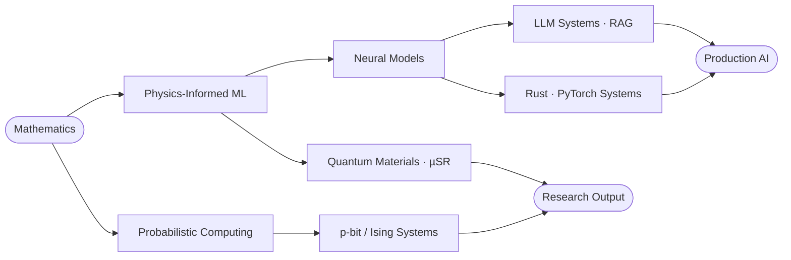

<div align="center">


<br/>


<br/><br/>

<a href="https://github.com/TheOrganic-code/TheOrganic-code/blob/main/Ayush_Pandey_Research_Resume.pdf"></a>
<a href="https://linkedin.com/in/ayushpandey1801"></a>
<a href="https://huggingface.co/TheOrganic-code"></a>
<a href="mailto:25mc3016@rgipt.ac.in"></a>

</div>

<br/>

---

## 👋 About

<table>
<tr>
<td width="55%" valign="top">

I'm a **B.Tech Mathematics & Computing** student at **Rajiv Gandhi Institute of Petroleum Technology (RGIPT)**, working at the intersection of **machine learning, physics, and systems**.

My research uses **physics-informed neural networks** to understand quantum materials through **muon spin spectroscopy (µSR)**. On the engineering side, I build LLM pipelines, retrieval systems, and neural network machinery from scratch in Rust.

> *Understand the abstraction, then go underneath it.*

</td>
<td width="45%" valign="top">

```text
$ cat profile.txt

name       : Ayush Pandey
education  : B.Tech, Math & Computing
institute  : RGIPT, Jais (2025–2029)
cpi        : 8.22 / 10
research   : Physics-Informed ML · µSR
building   : Rust ML · LLM Systems
learning   : GPU programming
status     : building.
```

</td>
</tr>
</table>



---

## 🧪 Experience

<table>
<tr>
<td width="50%" valign="top">

### Quantum Materials Lab · RGIPT
**Undergraduate Researcher** · *Jan 2026 – Present* · Jais, India

- Researching **µSR** to determine dipolar and local fields in crystal structures using **PINNs and PhyCNNs**
- Computational materials modelling with **Pymatgen + PyTorch**; physical dataset analysis with NumPy, SciPy, Pandas
- First-author manuscript on accelerated muon-site detection via modern ML

`PINNs` `PhyCNNs` `µSR` `Pymatgen` `PyTorch`

</td>
<td width="50%" valign="top">

### Qinetic Research Labs
**Researcher** · *Jun 2026 – Present* · Remote (US-based)

- Applying **PINN strategies to quantum computing** problems
- Extending physics-informed learning to non-classical systems

`Quantum Computing` `PINNs` `Scientific ML`

</td>
</tr>
<tr>
<td width="50%" valign="top">

### Digitwin Technology
**AI Engineer Intern** · *May 2026 – Jul 2026* · Chennai, India

- Fine-tuned LLMs on industrial datasets via **LoRA / QLoRA** for specialised enterprise workflows
- Built and optimised **RAG pipelines** for accurate retrieval over proprietary knowledge bases
- Translated research-grade techniques into production-ready systems

`LoRA / QLoRA` `RAG` `LLM Fine-Tuning` `Industrial AI`

</td>
<td width="50%" valign="top">

### ICCFGC
**Data Scientist** · *Jul 2026 – Present* · Coimbatore, India

- Contributing ML and data science expertise to **urban planning and remote sensing**

`Data Science` `Remote Sensing` `Machine Learning`

</td>
</tr>
</table>

---

## 📚 Research & Publications

<table>
<tr>
<td width="50%" valign="top">

### MEOWN
**Physics-informed neural framework for rapid prediction of muon stopping sites in crystalline materials**

For understanding quantum magnets using muon spectroscopy.

`First Author` · `Under review at Physical Review B` · `QM Lab, RGIPT`

</td>
<td width="50%" valign="top">

### Ba₃LnRu₂O₉ (Ln = Ho, Gd) · µSR
**Homogeneous to Multi-Scale Inhomogeneous Complex Magnetism in Ba₃LnRu₂O₉, Probed by µSR**

With S. Ghosh, E. Kushwaha, M. Kumar, G. Roy, K. Sharma, F. L. Pratt, S. Cottrell, D. T. Adroja, T. Basu.

`Contributing Author` · `Phys. Rev. B · Under Review`

</td>
</tr>
<tr>
<td colspan="2" valign="top">

### Grokking in Root-Function Networks · *ongoing*
Studying grokking in networks trained on x<sup>1/k</sup> for k = 2–10, with the hypothesis of a **critical threshold k\*** above which generalization permanently fails. x<sup>1/4</sup> grokked after a ~5,400-step delay, while x<sup>1/5</sup> failed to generalize within 30k steps. **Targeting an arXiv preprint.**

`PyTorch` `NumPy` `Generalization` `Training Dynamics`

</td>
</tr>
</table>

---

## 🏆 Achievements

<table>
<tr>
<td width="50%" valign="top">

### 🔬 Spallation Neutron Source
**IPTS-36564 · Oak Ridge National Laboratory · Jun 2026**

Awarded competitive neutron beam time at ORNL, USA, as **On-site Principal Investigator (OPI)**.

</td>
<td width="50%" valign="top">

### 🛰️ ISRO Bharatiya Antariksh Hackathon 2026
**PS-11 · Selected for next round**

**Ranked 2** in our problem statement in India, with **SatFetch** (cross-modal satellite retrieval).

</td>
</tr>
<tr>
<td width="50%" valign="top">

### 🏦 Union Bank Ideathon
**Finalist · Top 40 of 1500+ teams · Jun 2026**

Innovative fintech / banking technology solution.

</td>
<td width="50%" valign="top">

### 🎓 JEE Advanced
**Qualified · Jun 2025**

Top 1–2% among ~1.5M candidates.

</td>
</tr>
</table>

**Positions of responsibility:** Undergraduate Researcher, QM Lab, RGIPT (led computational µSR modelling independently; collaborated on two manuscripts with faculty and **STFC / ISIS** collaborators, UK) · Training & Placement Co-ordinator, Mathematical Sciences Dept., RGIPT.

---

## 🚀 Projects

<table>
<tr>
<td width="50%" valign="top">

### 🛰️ SatFetch
**Cross-modal satellite retrieval** · *Jan 2026*

CLIP-based retrieval over Indian EO data for **optical, SAR, multispectral, and text queries**. FAISS + Uber H3 give simultaneous semantic and geographic retrieval, with zero-shot cross-sensor search via SatCLIP, DOFA-CLIP, and SARCLIP.

`PyTorch` `FAISS` `Uber H3` `SatCLIP` `DOFA-CLIP` `SARCLIP`

</td>
<td width="50%" valign="top">

### 🦀 NeuraRust
**Neural network framework from scratch in Rust** · *Jan 2026*

Memory-safe, zero-cost abstractions with no external ML dependencies. Implements **tensor ops, autograd, and modular layer APIs** for high-performance inference pipelines.

`Rust` `Autodiff` `Tensors` `NN Primitives`

</td>
</tr>
<tr>
<td width="50%" valign="top">

### 🎲 Physics-Informed p-bit Simulator
**Probabilistic computing in PyTorch** · *Nov 2025*

Stochastic simulator for **Ising spin systems and Boltzmann machines** with tunable thermal noise. Convergence verified on **MAX-CUT** benchmarks; growing into a reusable PyTorch-compatible p-bit library.

`PyTorch` `NumPy` `Ising` `Energy-Based Models`

<a href="https://github.com/TheOrganic-code/P-bit-Simulator"></a>

</td>
<td width="50%" valign="top">

### 🧠 Grokking in Root-Function Networks
**Research · ongoing**

Empirical study of delayed generalization on x<sup>1/k</sup> targets, searching for a critical threshold k\*. See the research section above.

`PyTorch` `NumPy` `arXiv (planned)`

</td>
</tr>
</table>

<details>
<summary><b>More builds</b> · Rust data structures, security, and applied ML</summary>

<br/>

| Project | What it is |
|---|---|
| **B+Tree_RS** | B+ Tree in Rust for ordered indexing and storage: generic types, node splitting, rebalancing, ordered traversal |
| **SecureFlow** | Security-oriented project exploring safer application workflows and system architecture |
| **Habitability_Predictor** | ML system on planetary features and habitability indicators: feature engineering, supervised learning, evaluation |
| **Brain_Tumor_Classifier** | CNN-based brain tumor classification pipeline with Grad-CAM explainability |

</details>

---

## 🛠️ Stack

<div align="center">


</div>

<br/>

| | |
|---|---|
| **Languages** | Python · C++ · Rust · LaTeX |
| **ML / DL** | PyTorch · scikit-learn · CNNs · Energy-Based Models · Grad-CAM · LoRA / QLoRA |
| **LLM Inference** | KV Cache · FlashAttention · Speculative Decoding · GPTQ · AWQ · vLLM · `torch.compile` |
| **Data & Scientific** | NumPy · Pandas · SciPy · Pymatgen · Matplotlib · Seaborn · MATLAB |
| **Systems & Tools** | Git · Linux · WSL2 · GitHub · Rust (systems) |
| **Currently exploring** | GPU programming (Triton / CUDA) · Quantum computing · Particle physics |

<div align="center">


</div>

---

## 📊 GitHub

<div align="center">


<br/><br/>


</div>

---

## 🧭 Interests

`Physics-Informed ML` · `µSR Spectroscopy` · `Quantum Materials` · `Quantum Computing` · `Probabilistic & Stochastic Computing` · `LLM Inference Optimisation` · `Rust Systems` · `GPU Programming` · `Particle Physics` · `Remote Sensing` · `Science Communication` · `Algorithms`

**Languages:** Hindi (Native) · English (Professional Proficiency)

---

<div align="center">

```text
while (alive) {
    learn();
    build();
    question_abstractions();
    optimize();
}
```

<a href="https://github.com/TheOrganic-code"></a>
<a href="https://linkedin.com/in/ayushpandey1801"></a>
<a href="https://huggingface.co/TheOrganic-code"></a>

### 25mc3016@rgipt.ac.in


</div>
